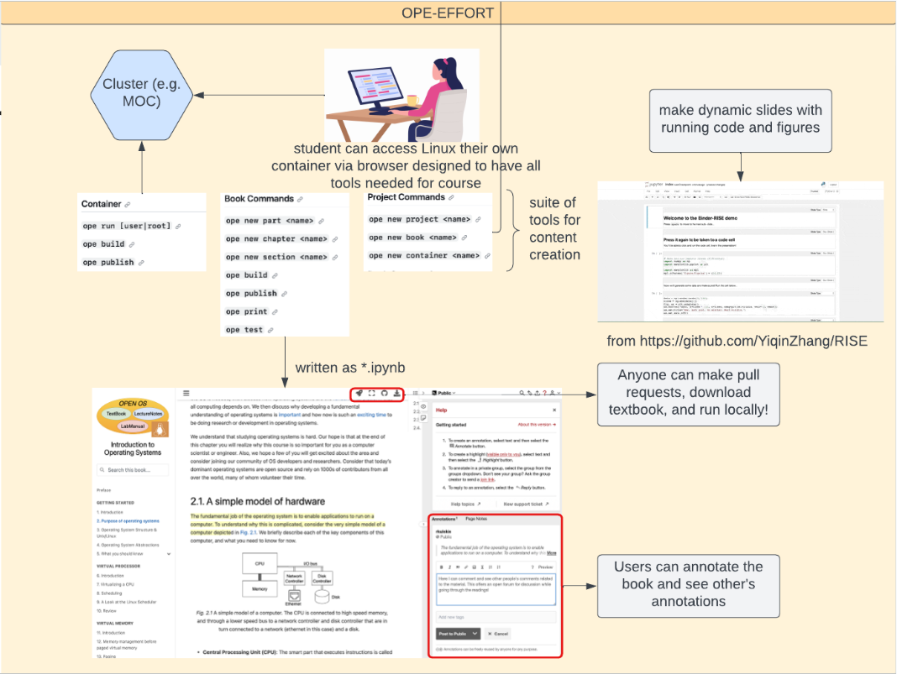

# Open Education Project Systems Testing

**Team Members**: Yuxi Ge, Jonathan Mikalov, Riya Deokar, Ross Mikulskis, Yiqin Zhang

**Mentor**: Isaiah Stapleton

## Project Description

The Open Education (OPE) project is dedicated to enriching educational technology through the integration of Jupyter notebooks and Linux terminal activities, intended for students, educators, and infrastructure developers. Our specific initiative, the Open Education Testing project, focuses on developing system tests within RedHat Openshift Service on AWS(ROSA) and also the New England Research Cloud(NERC). These tests are meticulously designed to verify the systems-level functionality of containers and their associated infrastructure, ensuring robust and reliable support for the Open Education (OPE) environment.

Our GitHub repository is a comprehensive collection of our group's work to date, organized into several core branches, each with its distinct history.

**main**: The main branch is home to the primary system tests for the OPE infrastructure, providing a foundation for our testing framework.

**ope-tools**: The ope-tools branch contains the main ope tools for creating Open Source educational content, assisting users in getting started with their projects.

**book-templete:** This branch acts as a template for an OPE book within an OPE project, offering a standardized format for content creation.

**book-documentation:** Our [OPE textbook](https://ec528-fall-2023.github.io/Open-Education-Testing/features_intro.html) encompasses all of our documentation.

## 1. Vision and Goals Of The Project:

Our project's vision is to create an innovative and immersive educational environment where the integration of Jupyter notebooks and Linux terminal interactions transcends traditional learning boundaries. We aim to cultivate a dynamic ecosystem where teachers and students can utilize technology to enhance the educational experience. Some of our visions and improvements consist of:

Integration of Comprehensive Tests: We recognize the importance of the Master_Container_Test.yml, which consolidates various image, build, gdb, and UI tests into one. To improve this, we will continually update and expand the test suite to cover a broader range of scenarios and edge cases. This will ensure comprehensive validation of the OPE repository base container image.

Recognizing limitations of outdated testing methods: We are committed to a modernization effort centered around automation. By embracing automated testing, continuous integration and deployment, and scalable frameworks, we aim to improve reliability, efficiency, and adaptability in our testing approach. This shift ensures that as the Open Education (OPE) project evolves, testing practices evolve with it, delivering a more robust and future-ready educational platform.

Continuous Monitoring: We will implement continuous monitoring of our container images to identify any discrepancies, vulnerabilities, or performance issues. This proactive approach will help us maintain the reliability and security of the OPE environment.

Custom Test Development: As part of our commitment to improving the OPE project, we will develop new custom tests tailored to the specific requirements and unique features of our containerized educational materials. These tests will be designed to address our project's needs.

Training and Skill Development: We recognize the importance of equipping our team members with the skills and knowledge required to excel in testing and automation. We will invest in training, building, and skill development to enhance our team's capabilities.

## 2. Users/Personas Of The Project:

Open Education Testing offers a comprehensive Testing Integration suite designed to cover a broad range of scenarios and edge cases. This approach ensures the thorough validation of the base container image in the OPE repository. Embrace technological progress by utilizing automation, efficient continuous integration, deployment, and scalable frameworks.

Users of this platform may include but are not limited to:

1. **Computer Science Educators: e.g. Professor Emily**

- _Background and Role_: Professor Emily is an experienced educator teaching computer systems courses. She relies on the Open Education platform to provide high-quality educational materials to her students.
- _Needs and Goals_: Emily needs a reliable and secure environment for her students to access Jupyter notebooks and interact with Linux terminals. She values easy customization options for tailoring materials to her course and offering a standardized container environment in which her students can code.

2. **Students: e.g. Alex**

- _Background and Role_: Alex is a computer science student using the Open Education platform to learn about computer systems.
- _Needs and Goals_: Alex expects a user-friendly interface, interactive Jupyter notebooks, and access to Linux terminals for practical learning.

2. **Teachers of Any Subject: e.g. Wayne**

- _Background and Role_: Wayne is a guitar music professor who has various musical excercises and resources for his class.
- _Needs and Goals_: Wayne wants to publish these materials online while being able to collaborate with his colleagues on content creation.

These user personas represent a diverse set of users who can benefit from the functionalities of the Open Education project. Each persona has unique needs, goals, and challenges that the project can address to enhance the educational experience. The OPE project allows them to all fulfill their needs and goals by providing a system through which to create content, collaborate, learn, and curate customized container learning environments.

## 3. Scope and Features of the Project

1. **Comprehensive Testing**: The Master_Container_Test.yml serves as the core feature that includes all relevant image, build, gdb, and UI tests.
2. **Automation and Build**: Automating image build, versioning, and pushing to the registry.

3. **Health Metrics**: Periodic health check-ups to ensure container functionality.

4. **Package and Version Consistency**: Automated checks for software versions against a predefined list (versions.txt).

5. **UI Validation**: Selenium-based tests for interface and visual elements in Jupyter Lab environment.

6. **GDB Functionality**: Automated bash scripts for validating GDB functionality 100 times.

7. **Security Checks**: Ensuring checksum integrity of the container image.

8. **Metrics Display**: Real-time display of build time and size.

9. **Approval Mechanism**: A feature to send and receive authorization approvals.

10. **Publication**: Publishing the approved, stable image to OPE’s quay.io repository.

## 4. Solution Concept

**Architecture**

Throughout the duration of this project, we will be contributing directly to open education tests. These tests directly involve the functionality of jupyter notebooks and other supported platforms. They do not involve server-side support, such as containerized support and remote access.

1. **Test Notebook Template**

   - We are developing a standaridzed template for Jupyter notebooks involving a variety of tests
   - Tests include UID/GID checks, write permissions, accessible storage, and networking.
   - This template will allow users to run quick diagnotistics to ensure system compatability

2. **OPE Tool**

   - The OPE tool is central to the OPE project for providing an easy-to-work-with interface for writing and cloning Jupyter Notebook textbooks.
   - The test notebook template will be integrated within the OPE Tool, which can be used for generating reports documenting compatability failures
   - We will be adding a new command to OPE Tool to allow users to create test reports on demand

3. **Environment Specific Tests**
   - We're enhancing our testing approach by crafting environment-specific testing scripts
   - Tailoring the solution makes our tests more robust, addressing critical aspects like user ID generation and unique user limits within the NERF environment.
   - These scripts ensure comprehensive validation, adaptability to evolving conditions, and resilience in our educational platform, reinforcing our commitment to meeting project-specific requirements effectively.

## 5. Acceptance criteria

Minimum acceptance criteria:

- Develop a Test Notebook Template. The tests ensure that the base container only passes the build process if all of the packages are compatible and fully functioning, the address randomization is off so that debugging tools like gdb work, and all content functions as intended.
- Successfully deploy base container to NERC or some test cluster.
- Implement all of the ope commands listed in the OPE-Testing _tools_ branch as described by Professor Appavoo to allow for a more user-friendly framework for content creation. Also, add necessary documentation for these commands.

Stretch goals:

- Add tool for translating textbooks written in LaTeX into the Jupyter Notebook format so that they can be hosted online and provide additional functionality by incorporating the suite of Jupyter tools.

## 6. Release Planning:

Release planning section describes how the project will deliver incremental sets of features and functions in a series of releases to completion. Identification of user stories associated with iterations that will ease/guide sprint planning sessions is encouraged. Higher level details for the first iteration is expected.

1. **Build OPE Base Image and Container Locally and Verify Testing Procedures (8 tests)**
   - Construct the OPE base image both locally. Ensure the image is functional and can run seamlessly.
   - Familiarize with the Makefile and Dockerfile and Gain a comprehensive understanding of their structures and functionalities to aid in future modifications.
   - Refactor the Makefile and Dockerfile to ensure system independence and compatibility across various Instruction Set Architectures, specifically arm64 and x86.
   - Navigate to the workflow file located at `OPE-Testing/.github/workflows/Master_Container_Test.yaml`. Run the predefined tests and assess their performance, ensuring all tests function as expected.
2. **Create test notebook template for building/running OPE**
   - Write address randomization tests using gdb.
   - Test home directory, read/write permissions
   - Check pip install and configuration files
   - Perform UID / GID checks to ensure permission compatability
3. **Revise OPE Tests with Exception Handling and Standardize Tests**
   - Enhance existing tests with robust exception handling to provide developers with clear indications of build issues or failures.
   - Merge tests into one single notebook, standardizing under a common framework to properly report errors
4. **Add functionality for ope commands and revise GitHub Actions**
   - Verify and test each GitHub action found in .github/workflows to ensure proper build compatability tests
   - Create functionality for missing OPE commands in tools branch, including but not limited to: `ope new part`, `ope new section`, `repo_add`
   - Create autograding framework to incorporate OPE into gradescope to allow for exporting testing onto OPE container to circumvent any potential kernel incompatibilities between the gradescope kernel and the OPE course assignments.
   - Fix github actions workflow for conainer build to work. Also, identify and fix any broken tests and make tests more robust.
5. **Write code to translate LaTeX projects into OPE Jupyter NB framework**
   - At least start the framework for this. A professor who already wrote their textbook in LaTeX wants an easy migration to this platform to reap all the benefits of the OPE features and hosting it online, but the barrier to entry is all the work of rewriting.
   - Write this code with pandoc and bash, maybe python too to parse sections of LaTeX and use _ope tools_ developed in sprint 4 to make this process easier.

---

Here are a couple repos that are important to our project, forked from the OPE repos:

- [https://github.com/rkulskis/ope-quay](https://github.com/rkulskis/ope-quay) (fork of [https://github.com/OPEFFORT/OPE-Testing](https://github.com/OPEFFORT/OPE-Testing))
- [Our documentation formatted as an OPE book](https://rkulskis.github.io/enhanced-ope/features_intro.html)
- [UI/RISE tests](https://github.com/YiqinZhang/OPE-Testing/tree/container-base-ope/tests)

## Videos

- **[Sprint 1 Recording](https://drive.google.com/file/d/1SKNGodw3gZbhzO0-K-_QMrUeJU3uBJo4/view?usp=sharing)**
- **[Sprint 2 Recording](https://drive.google.com/file/d/1lJqYb4c8eatcnu1teSPzbsKXZmZMlphi/view?usp=sharing)**
- **[Sprint 3 Recording](https://drive.google.com/file/d/1Iy90VqmvtLN4ZKXjmvYmGfP7ebv0lfrO/view?usp=drivesdk)**
- **[Sprint 4 Recording](https://drive.google.com/file/d/10FLkKA6gf2eeo9uehe-S4B2JsGAIUzuN/view?usp=sharing)**
- **[Sprint 5 Recording](https://drive.google.com/file/d/1DQGUJ51WrX0bTas6FinE0E0j-jUvZuvq/view?usp=sharing)**

## Slides

- **[Sprint 2 Slides](https://docs.google.com/presentation/d/1fL5fSKnzFHu7jynSGlMBzb1nYSS9v-ooWViMfuFNXDw/edit?usp=sharing)**
- **[Sprint 3 Slides](https://docs.google.com/presentation/d/1KDC8MQQU-c8FvkvjlLuOMwSis7lFfOR7dl87srLiVJI/edit)**
- **[Sprint 4 Slides](https://docs.google.com/presentation/d/1HK9a5vZwhh9qlOvg9w80FTByqJsgYASfIkLrn7RkrcI/edit?usp=sharing)**
- **[Sprint 5 Slides](https://docs.google.com/presentation/d/1-K1lTJiUGgStfITrlwY8ZA3AZIKqTuAm6VI3op20L5Q/edit?usp=sharing)**
