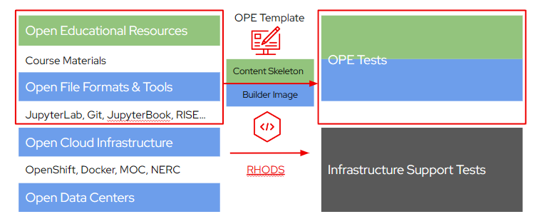

** **

## Project Description Template

The purpose of this Project Description is to present the ideas proposed and decisions made during the preliminary envisioning and inception phase of the project. The goal is to analyze an initial concept proposal at a strategic level of detail and attain/compose an agreement between the project team members and the project customer (mentors and instructors) on the desired solution and overall project direction.

This template proposal contains a number of sections, which you can edit/modify/add/delete/organize as you like.  Some key sections we’d like to have in the proposal are:

- Vision: An executive summary of the vision, goals, users, and general scope of the intended project.

- Solution Concept: the approach the project team will take to meet the business needs. This section also provides an overview of the architectural and technical designs made for implementing the project.

- Scope: the boundary of the solution defined by itemizing the intended features and functions in detail, determining what is out of scope, a release strategy and possibly the criteria by which the solution will be accepted by users and operations.

Project Proposal can be used during the follow-up analysis and design meetings to give context to efforts of more detailed technical specifications and plans. It provides a clear direction for the project team; outlines project goals, priorities, and constraints; and sets expectations.

** **

## 1.   Vision and Goals Of The Project:

The vision section describes the final desired state of the project once the project is complete. It also specifies the key goals of the project. This section provides a context for decision-making. A shared vision among all team members can help ensuring that the solution meets the intended goals. A solid vision clarifies perspective and facilitates decision-making.

The vision statement should be specific enough that you can look at a proposed solution and say either "yes, this meets the vision and goals", or "no, it does not".

## 2. Users/Personas Of The Project:

Open Education is designed to provide greater accessibility for computer science educators and students. Users will have an easy method of distributing their content from a virtual environment through open source material. This is included but may not be limited to online textbooks, lectures, machine learning tools, as well as interactive kernel environments. Hosts of large computer science events (ie. hackathons) will also be able to use this online platform to provide a consistent environment among each user, with the same packages for everyone. Users of this platform may include but are not limited to:
* Educators within any field of computer science or engineering
* Authors looking to publish free open-source textbooks online
* Students involved in large computer science activites or events

** **

## 3. Scope and Features of the Project: Testing OPE (Open Education Platform)

### Scope

1. **In-Scope:**

   - **Setup-and-Build**: Building and pushing beta images to quay.io.
   - **Health-Check**: Verifying container uptime.
   - **Image-Version-Check**: Confirming correct image and tag.
   - **JupyterNB-Test**: Checking package imports in Jupyter Notebook.
   - **Package-Version-Test**: Version consistency of installed packages.
   - **Checksum**: Validation of container image checksum.
   - **Size-and-Time-Display**: Metrics for build time and image size.
   - **UI-Test**: Functionality and layout checks using Selenium.
   - **GDB-Test**: GDB functionality validation.
   - **Approval**: Authorization process.
   - **Publish**: Publishing the stable image to OPE's quay.io repo.

2. **Out-of-Scope:**

   - Code development for OPE features.
   - Infrastructure setup for Mass Open Cloud.
   - Content creation for educational material.
   - Manual quality assurance tests.

### Features

1. **Comprehensive Testing**: The Master_Container_Test.yml serves as the core feature that includes all relevant image, build, gdb, and UI tests.
   
2. **Automation and Build**: Automating image build, versioning, and pushing to the registry.

3. **Health Metrics**: Periodic health check-ups to ensure container functionality.

4. **Package and Version Consistency**: Automated checks for software versions against a predefined list (versions.txt).

5. **UI Validation**: Selenium-based tests for interface and visual elements in Jupyter Notebook.

6. **GDB Functionality**: Automated bash scripts for validating GDB functionality 100 times.

7. **Security Checks**: Ensuring checksum integrity of the container image.

8. **Metrics Display**: Real-time display of build time and size.

9. **Approval Mechanism**: A feature to send and receive authorization approvals.

10. **Publication**: Publishing the approved, stable image to OPE’s quay.io repository.

## 4. Solution Concept

Throughout the duration of this project, we will be contributing directly to open education tests. These tests directly involve the functionality of jupyter notebooks and other supported platforms. They do not involve server-side support, such as containerized support and remote access.
 
 

## 5. Acceptance criteria

This section discusses the minimum acceptance criteria at the end of the project and stretch goals.

## 6.  Release Planning:

Release planning section describes how the project will deliver incremental sets of features and functions in a series of releases to completion. Identification of user stories associated with iterations that will ease/guide sprint planning sessions is encouraged. Higher level details for the first iteration is expected.

** **

## General comments

Remember that you can always add features at the end of the semester, but you can't go back in time and gain back time you spent on features that you couldn't complete.

** **

